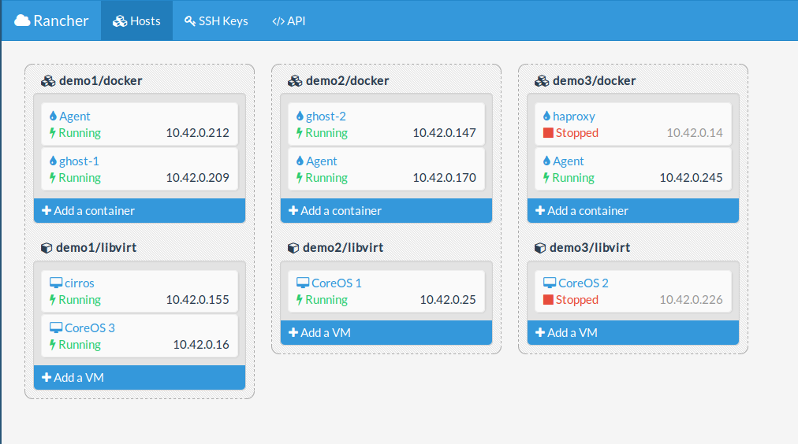

# Stampede

Stampede is a hybrid IaaS/Docker orcherstration platform running on CoreOS.  Starting with an empty CoreOS cluster, within a couple minutes, you should have a very capable platform to run both virtual machines and Docker.  Stampede strives to add complex orchestration already seen in IaaS to Docker ultimately enhancing the capabilities in networking, storage, and management.  In the end, the goal is to continue to support traditional IaaS while at the same time make Docker and containers more accessible.

[](http://youtu.be/UsQ9cVLieaQ)

## Installation

Start with a blank CoreOS cluster with Fleet and Etcd configured.

```bash
wget http://stampede.io/latest/cattle-stampede.service
fleetctl start cattle-stampede.service
```
Wait for bits to fly across the interwebs (could take 10 minutes...)
```
fleetctl list-units
```
Output
```
UNIT                                            DSTATE          TMACHINE                STATE           MACHINE                 ACTIVE
cattle-libvirt.7ffe1d-b2c083.service            launched        b2c0835f.../10.42.1.115 launched        b2c0835f.../10.42.1.115 active
cattle-stampede-agent.76bcfb-b2c083.service     launched        b2c0835f.../10.42.1.115 launched        b2c0835f.../10.42.1.115 active
cattle-stampede-server.01c222-b2c083.service    launched        b2c0835f.../10.42.1.115 launched        b2c0835f.../10.42.1.115 active
cattle-stampede.service                         launched        b2c0835f.../10.42.1.115 launched        b2c0835f.../10.42.1.115 active
```

**The API/UI is available at 9080 of your server.**

## Vagrant

```
git clone https://github.com/cattleio/stampede.git
cd stampede
vagrant up

# Open you browser to http://localhost:9080
```

API/UI will be accessible at **http://localhost:9080**.  Running Vagrant may take ***10 minutes to install, so please be patient.***  [Refer to the documentation](vagrant/README.md) for running a multi-node Vagrant setup.  If you are running a multi-node setup, Vagrant may auto allocate different ports for 9080 for the additional nodes.

# UI



# Functionality

* Virtual Machines
  * Libvirt/KVM
  * EC2/OpenStack images work out of the box
  * EC2 style meta data
  * OpenStack config drive
  * Managed DNS/DHCP
  * User data
  * Floating IPs
  * Private networking
  * VNC Console
  * CoreOS, Ubuntu, Fedora, and Cirros templates preconfigured
* Docker
  * Link containers across servers
  * Dynamically reassign links and ports
* Networking
  * VMs and containers can share the same network space
  * By default, a private IPSec VPN is created that spans servers
  * All containers and VMs live on a virtual network that can span across cloud
  * Can also use any libvirt networking models for VMs
* Interface
  * UI
  * REST API
    * Use web browser to explore and use API
  * Command line client
  * Python API bindings

# Stampede.io and Cattle.io

You’ll find plenty of references to cattle or cattle.io in Stampede.  [Cattle.io](http://cattle.io) is the underlying framework that implements all the real logic of Stampede.  Cattle.io is extremely flexible and can be bent to do many things and run on many platforms.  Stampede was created as a project to package Cattle.io in a very simple and straight forward fashion that should work for the majority of users.  As such, Stampede marries Cattle.io with CoreOS and Fleet to provide a very a simple full stack solution.

# Why was this built?

Stampede and the underlying cattle.io framework was created by me as part of a 6 month R&D project.  My current employer graciously allowed me to go off on my own and experiment with new ideas in the infrastructure orchestration space.  The basic premise was to take all that we know from 5+ years of writing IaaS systems, combine that with containerization, and see what we can do.  The purpose was really to play with new ideas.

## Concepts

If I have the time I'll blog in depth about the below topics, but just to give you any idea, here are a list of things I've focused on.

**Orchestration as a Service:**  By decoupling orchestration from infrastructure one can level the playing field such that you don't need to be as big as AWS, GCE, Azure to be relevant in the cloud space.  I've explored this concept [in depth on my blog](http://www.ibuildthecloud.com/blog/2014/08/12/evolution-of-docker-and-its-impact-on-aws/).

**Hybrid IaaS/Container Orchestation System:**  Traditional IaaS systems are not a good fit for containers.  Container orchestration systems largely ignore the complex orchestation of networking and storage.  Combining the two you get a very complete solution.

**Non-reliable messaging:** Reliable (and persistent) messaging adds yet another repository of state making an already complex problem even more complex.  Stampede was built with no assumption of reliability in the messaging layer.  There is no guarantee that any message sent will ever be received.

**Idempotency:**  Infrastructure components fail often (in the computer science sense).  The use of idempotency allows operation to more easily recover from bad situations.  Idempotency in all operations is not only a good practice that was used in building Stampede, but it is actually built into the architecture and enforced by the framework.

**EC2 architectural compatibility:**  EC2 is the de-facto standard in IaaS.  While designing the core concepts of Stampede, extra care was take to ensure that the concepts used would be architecturally compatible with EC2 (especially networking).

**Extensibility:**  While the core languages used in Stampede were chosen for very specific reasons, one should be able to extend the orchestration of Stampede in any language using a very simple event driven REST API.

**Simplified orchestration:**  In an attempt to provide more reliable orchestration people often propose or gravitate towards complex workflow engines.  Stampede tries to find an elegant balance between complex workflows and naive sequential programming.  Stampede is heavily focused on the [concept of managing state transitions](http://docs.cattle.io/en/latest/concepts/orchestration.html) and attaching logic to those transitions.

**Flexible Networking:** The simplest and most scalable network designs are often in conflict with the current IaaS systems of today.  I wanted to build a networking model that not only caters to new SDN and L2 virtualization models, but also simple scalable L3 networks.

# Docker philosophy

While many systems today are “powered by” Docker, I wanted Docker to be a first class citizen.  Just as EC2 defined the language in how we now describe virtual machines in the cloud, I believe Docker will define a similar language for containers.  As such, Stampede does not try to mask Docker, bend it’s constructs, or invent new ones.  I am very interested in taking the concepts and models that Docker has defined, such as ports, link, volumes, and respecting those in Stampede.  The only difference being that while running in the context of Stampede I may often replace the implementation of those concepts with my own implementation to provide a more robust solution.  For example, one of the first features I implemented was cross server container linking.  This respects the full interface that Docker has defined with environment variables, but Stampede controls the values of the environment and the network target.

# Plans?

There are plenty of things I'd like to do with this platform, but it all depends on whether there is a larger interest in this work.  [Let me know](#contact) if you find this project interesting.

# Networking Configuration

Networking is difficult.  It's difficult because there are a million ways to do it.  Cattle.io, under the hood, has a very flexible networking model, but currently it is not fully exposed for good reason.  Right now when you deploy a container or VM you have the choice of doing a "Managed" or "Unmanaged" network.  If you choose neither, it will default the managed.

## Unmanaged Networking

The unmanaged network means that Cattle.io will not manage the networking at all (fancy that).  This means that for containers it will just do the default Docker behaviour, links will be limited to the current server, and port's won't be dynamic.

For VMs it will create one NIC and use the default libvirt networking configuration.  This ends up being a nice hook.  What you can do is log into your individual nodes and using `virsh` you can change the network mode.  For example

```bash
virsh net-edit default
# Edit to something like below.  The below will bridge your VM to eth0.
# <network>
#     <name>default</name>
#     <uuid>836c1821-ada6-49d1-b5a5-39423fe8d385</uuid>
#     <forward dev='eth0' mode='bridge'>
#         <interface dev='eth0'/>
#     </forward>
# </network>
virsh net-destroy default
virsh net-start default
```

Since Cattle.io supports the OpenStack cloud config drive, the user-data and meta-data will still be available to the VM.

## Managed Networking

The managed networking model will put your containers and VMs on a private IPsec based network.  IPsec is used to secure the communication across hosts and additionally create your own private subnet (10.42.0.0/16).  Under the hood, there is a lot of fanciness used to make this work.  Most likely I will switch the default networking model to be VXLAN based in the future.  The current IPsec approach was done as an experiment.  It is currently working, but it is not fully tested for scale.

### Setting up Public IPs

Since the managed networking model will put your VM on a private network, it will not be publicly accessible.  You can also log into the server on which the VM resides and SSH to it, or jump to it from another VM on the same private network.  Chances are, if you not doing development, you want the VM to be publically accessible.  To do this you need to create an IP pool that VMs can use for public IPs.  If you would like to use 192.168.10.0/24 as your IP range, then run the following command:

    cattle create-subnetIpPool --networkAddress 192.168.10.0 --name "My IP pool"

The name is optional, but makes the UI nicer.  If you want a different CIDR size, range, or gateway, you can also specify those.  The full command would be something like

    cattle create-subnetIpPool --networkAddress 192.168.10.0 --name "My IP Pool" --cidrSize 24 --startAddress 192.168.10.200 --endAddress 192.168.210 --gateway 192.168.10.254

When you deploy your VM just choose the created IP pool for the `publicIpAddressPoolId`.  The acquired IP from the pool will be NAT'd to the private IP in a fashion to how EC2 and Elastic IPs work.

# Documentation

More documenation can be found at [cattle.io](http://cattle.io) and [docs.cattle.io](http://docs.cattle.io).  Granted it's all a bit light right now.

# Contact

Mailing List: https://groups.google.com/d/forum/stampedeio

IRC: darren0 on freenode

Twitter: @ibuildthecloud

# License

[Apache License, Version 2.0](http://www.apache.org/licenses/LICENSE-2.0.html)
