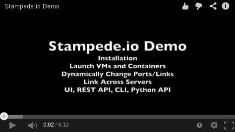

# Stampede

Stampede is a hybrid IaaS/Docker orcherstration platform running on CoreOS.  Starting with an empty CoreOS cluster, with in a couple minutes you should have a very capable platform to run both virtual machines and Docker (containers).

[](http://youtu.be/UsQ9cVLieaQ)

## Installation

Start with a blank CoreOS cluster with Fleet and Etcd configured.

```bash
wget http://stampede.io/latest/cattle-stampede.service
fleetctl start cattle-stampede.service
```
Wait for bits to fly across the interwebs (could take 10 minutes...)
```
fleetctl list-units
```
Output
```
UNIT                                            DSTATE          TMACHINE                STATE           MACHINE                 ACTIVE
cattle-libvirt.7ffe1d-b2c083.service            launched        b2c0835f.../10.42.1.115 launched        b2c0835f.../10.42.1.115 active
cattle-stampede-agent.76bcfb-b2c083.service     launched        b2c0835f.../10.42.1.115 launched        b2c0835f.../10.42.1.115 active
cattle-stampede-server.01c222-b2c083.service    launched        b2c0835f.../10.42.1.115 launched        b2c0835f.../10.42.1.115 active
cattle-stampede.service                         launched        b2c0835f.../10.42.1.115 launched        b2c0835f.../10.42.1.115 active
```

The API/UI is available at 9080 of your server.

## Vagrant

```
git clone https://github.com/cattleio/stampede.git
cd stampede
vagrant up
```

# UI

API/UI will be accessible at http://localhost:9080.  Running from Vagrant may take ***10 minutes to install, so please be patient.***  [Refer to the documentation](vagrant/README.md) for running a multi-node Vagrant setup.

# Functionality

* Virtual Machines
  * Libvirt/KVM
  * EC2/OpenStack images work out of the box
  * EC2 style meta data
  * OpenStack config drive
  * Managed DNS/DHCP
  * User data
  * Floating IPs
  * Private networking
  * VNC Console
  * CoreOS, Ubuntu, Fedora, and Cirros templates preconfigured
* Docker
  * Link containers across servers
  * Dynamically reassign links and ports
* UI
* REST API
  * Use web browser to explore and use API
* Command line client
* Python API bindings

# Contact

IRC: darren0 on freenode

Twitter: @ibuildthecloud

Email: darren at ibuildthecloud.com

# License

[Apache License, Version 2.0](http://www.apache.org/licenses/LICENSE-2.0.html)
